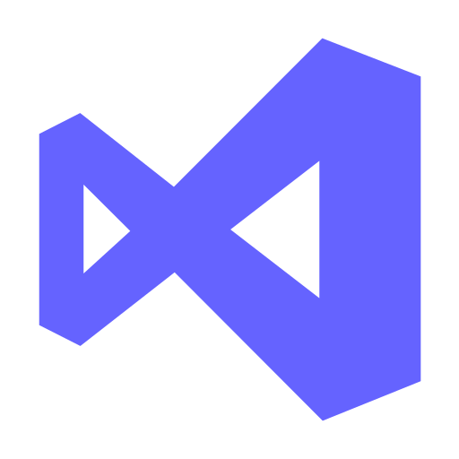

<h1>Why don't we connect and have chat?</h1>

<h1>👨🏻‍💻  A Little Bit About Me and My Interests</h1>
<h4>Name: Ali Ikmeil</h4>
<h5>located_in: Amman, Jordan</h5>
<h5>Junior Full-Stack developer</h5>
<h4>Education:</h4>
  
[
    "MERAKI Academy boot camp for Full-Stack development",
    "Graduated from Middle East University",
    "Bachelor's in Civil Engineering",
  ]

<h4>Fields_of_interests:</h4>

  [
    "Web Development",
    "Data Science",
    "Problem Solving",
    "Game Development",
  ]

  <h4>Skills:</h4>
  
[
    "JavaScript",
    "Python",
    "HTML",
    "Node.JS",
    "React.JS",
    "CSS"
  ]

  
<h4>currently_learning:</h4> 

["Python, Collecting more informations in JavaScript, React.JS and CSS"]

<h2>🚀  Some Tools I Have Used and Learned:</h2>

